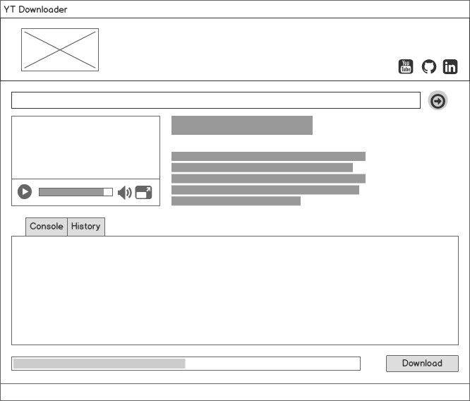
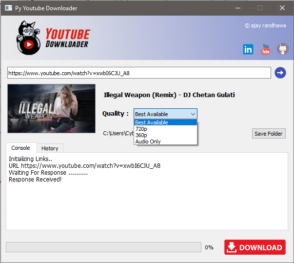

# Blackcat Youtube Downloader

Blackcat Youtube Downloader is Open Source GUI tool to download Youtube video. It is Developed with Python, Qt, and Pytube Library. It is Multi-thread Application. Best Available Option download video in highly available Quality . Download Videos in 720p, 480p,  360p etc. 

## Features

1. Graphical User Interface.
2. Multi-Threaded.
3. Fetch Title & Thumbnail.
4. High Quality Video Download.
5. Playlist Download (Soon...)

| Mockup | Screenshot |
| --------------------- | -------------------- |
|  |  |

### Downloader and Code Upload Soon.......:)
#### Happy Open Source......
